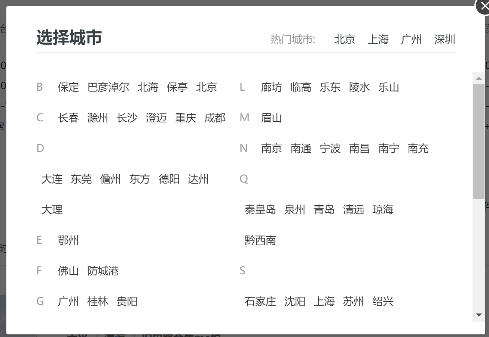
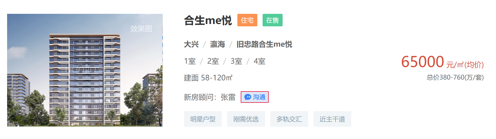

# 楼盘名字生成器
从链家爬取全国楼盘信息，使用LSTM实现房地产楼盘名的AI生成

## 前言
最初灵感来源于城市道路名称的相关数据分析，如[城市道路名图鉴](https://zhuanlan.zhihu.com/p/74299051)。国内楼市向来火热，地产楼盘名五花八门，风格各异，同时又存在一些定式，有时带有城市和开发商特色，但尚无较全面的整理。因此萌生了利用爬虫分析全国楼盘名称，并在此基础上开发基于AI的楼盘名称生成器的想法。  

模型部分参考了现有的[AI取姓名](https://blog.csdn.net/keyue123/article/details/89400680)及[AI写诗](https://github.com/braveryCHR/LSTM_poem)等项目。
## 运行效果  
```
python main.py
```
### 给定起始字生成楼盘名
```
请输入任意个起始字或随机生成楼盘名，输入exit退出：华威
楼盘名：华威中南云境

请输入任意个起始字或随机生成楼盘名，输入exit退出：平安
楼盘名：平安海新天地
```
### 随机生成楼盘名
```
请输入任意个起始字或随机生成楼盘名，输入exit退出：
楼盘名：景瑞天悦

请输入任意个起始字或随机生成楼盘名，输入exit退出：
楼盘名：江川华府

请输入任意个起始字或随机生成楼盘名，输入exit退出：
楼盘名：华发海湾国际
```
## 目录说明
- main.py  生成器主程序
- src存放爬虫、数据处理、模型及训练代码  
    > crawler.py  全国楼盘信息爬虫  
    > data_preprocess.py  原始数据处理  
    > model.py  模型和配置定义  
    > train.py 模型训练  

- data 存放所有数据文件  
    > city_url.json  链家各城市页面网址  
    > house_data.csv  爬虫获得的原始数据  
    > data_cleaned.csv  预处理后的楼盘数据  
    > vocabulary.npz  数组形式的楼盘名和数据对应词库  

## 楼盘信息爬虫  
### 定位城市页面
爬虫目标是链家的全国新房网站，以北京为例，url为https://bj.fang.lianjia.com/loupan/。观察可以发现，不同城市页面url的区别在于开头的城市缩写。而网页左上点开一个选择城市的弹窗，可以跳转到对应城市页面。

在网页源码搜索城市名，不难定位到下面的div标签，每个a标签的href记录了各城市的url。
```html
<div class="city-enum fl">
    <a href="//bd.fang.lianjia.com" title="保定房产网">保定</a>
    <a href="//byne.fang.lianjia.com" title="巴彦淖尔房产网">巴彦淖尔</a>
    <a href="//bh.fang.lianjia.com" title="北海房产网">北海</a>
    <a href="//bt.fang.lianjia.com" title="保亭房产网">保亭</a>
    <a href="//bj.fang.lianjia.com" title="北京房产网">北京</a>                           
</div>
```
### 获取页码
网页上会显示当前城市的房源数，源码可定位到如下标签：
```html
<div class="resblock-have-find">
    <div>
        <span>为您找到</span>
        <span class="value">184</span>
        <span>个北京新房</span>
    </div>
</div>
```
链家网站每页显示10个楼盘信息，因此对房源数除以10并向上取整获得需爬取的页数。
> - 部分城市实际能爬取的楼盘数小于显示的房源数
> - 链家网站上页数最多显示100页，但通过直接访问对应页码url的方式，实际能得到后面页数的楼盘信息。
### 定位楼盘信息

在源码中搜索某一楼盘名可定位到class为resblock-desc-wrapper的div标签，其中楼盘名记录在class为resblock-name的子标签中。其余子标签还记录了楼盘位置、户型、面积和价格等信息，与网页呈现内容对应。
```html
<div class="resblock-desc-wrapper">
    <div class="resblock-name">
        <a href="/loupan/p_hsmeybmbls/" ...>合生me悦</a>
        <span class="resblock-type" style="background: #FB9252;">住宅</span>
        <span class="sale-status" style="background: #53CC9A;">在售</span>
    </div>
    <div class="resblock-location">...</div>
    <a class="resblock-room"...></a>
    <div class="resblock-area">...</div>
    <div class="resblock-agent">...</div>
    <div class="resblock-tag">...</div>
    <div class="resblock-price">...</div>
</div>
```
>crawler.py中只爬取了楼盘名与每平米单价，若需要其余信息可额外从对应标签中获取。
### 爬虫伪装
链家网站有一定反爬监测，同一IP频繁爬取很快会弹出验证码。除了请求头的User-Agent伪装外，额外采取了以下措施：
1. 将上一次访问的页面记录作为爬取下一页时请求头的Referer，模拟人的页面访问逻辑
2. 每爬取一页随机暂停5s~15s，降低浏览速度。
> 有条件可以设置IP代理
## 数据处理  
### 数据清洗
基于以下原则对爬取的原始数据进行清洗  
1. 地产名字明显**不属于商品楼盘**的数据直接删除，如地块、酒店、步行街、物流园等
2. 去除楼盘名中的**无意义分隔符、特殊符号**等，如|、·、-。
3. 去除楼盘名中**不属于名字主体**的部分，如X期、X区和括号内内容。
4. 分离房地产开发商加在楼盘名中的**公司前缀**。
5. 去除楼盘名中的**城市名前缀**。 
### 词库
由于楼盘名经常由单字直接拼接而成，双字以上词语数据稀疏，因此直接将单字作为词单元建立词库。
### 序列长度
当前模型中只取名字长度为2~8的楼盘名进行训练。加上起始符\<SOS>和终止符\<EOS>后，序列长度为10。长度不足10的数据在终止符后填充<\\s>补齐。  


## 模型结构
``` python
class MyModel(nn.Module):
    def __init__(self, vocab_size, embedding_dim, hidden_dim):  # (词库大小, 词向量维度, LSTM隐藏层维度)
        super().__init__()
        self.hidden_dim = hidden_dim
        self.embeddings = nn.Embedding(vocab_size, embedding_dim)
        self.lstm = nn.LSTM(embedding_dim, self.hidden_dim, num_layers=2, batch_first=True)  # LSTM
        self.linear = nn.Linear(self.hidden_dim, vocab_size)  # 全连接层

    def forward(self, input_, hidden=None):
        batch_size, seq_len = input_.size()  # (batch_size, seq_len)
        if hidden is None:
            h_0 = Variable(torch.zeros(2, batch_size, self.hidden_dim))
            c_0 = Variable(torch.zeros(2, batch_size, self.hidden_dim))
        else:
            h_0, c_0 = hidden
        embeds = self.embeddings(input_)  # (batch_size, seq_len, embedding_dim)
        output, hidden = self.lstm(embeds, (h_0, c_0))
        output = self.linear(output.contiguous().view(batch_size * seq_len, -1))  # (batch_size, seq_len, hidden_dim)
        return output, hidden
```
##  使用注意
1. 当前数据量较少。由于仅爬取了链家全国新房数据，不涉及二手房，经过清洗后数据量不到20000条，词库大小不到2000词。
2. 由于1中的原因，冷门字可能不在词库内，或由于样本太少而训练不足。
2. 目前仅支持起始字生成楼盘名，不支持中间字生成。

详细说明待补全  
to be continuted
